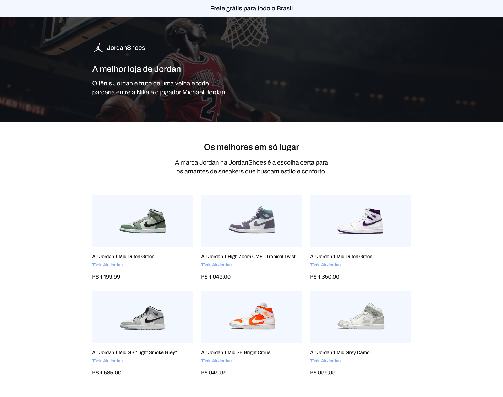

# Jordan Shoes

Desafio 2 da Codelândia. Mais um desafio proposto pelo <a href="https://www.linkedin.com/in/iuricode/">Iuri Silva</a>. O projeto é uma loja de sapatos da linha Air Jordan da Nike.

    

## 🛠 Techs utilizadas:
- *HTML*
- *CSS*

## ☑️ Status do Projeto:
**Concluido** ✅

## ⚙️ Funcionalidades:
*Em breve*

## 🔗 Links
- [🎨 Layout](https://www.figma.com/file/Yb9IBH56g7T1hdIyZ3BMNO/Desafios---Codel%C3%A2ndia?type=design&node-id=1883-2&mode=design&t=OluItDI5XsBfeNR2-0)

- [📄 Demo](https://lucavieira.github.io/jordan_shoes/)

## 👨🏼‍💻 Autor

<a href="https://github.com/lucavieira">
 
  
 <b>Lucas Vieira</b></a> <a href="https://github.com/lucavieira" title="Github">🚀</a>

Feito com ❤️ por Lucas Vieira 👋🏽 Entre em contato!

 
